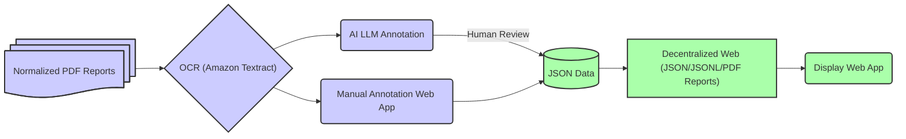

  <h1>Bad Apple Project White Paper</h1>
  v.1.0 (Jun. 25, 2025)
  

## Summary

The Bad Apple Project is a database of law enforcement misconduct and internal affairs reports filed against police officers and similarly titled law enforcement personnel working for state, county, and city level law enforcement entities in the United States. Our corresponding web app allows for users to access and display the data.

Although law enforcement misconduct and internal affairs reports are technically in the public domain, it is difficult for people to access them, much less understand their findings, as the format and content can vary greatly between each city, county, and state. It is our view that this data needs to be collected, standardized, and made easily accessible to the public.

## Use Cases

Our database and web app serves three overarching use cases:

1. **Read Police Internal Affairs Reports** - Allow for users to search for and read disciplinary reports on bad apple law enforcement personnel in the USA.
2. **Heatmap of Police Misconduct** - Facilitate generating reports, graphs, and heat maps of reported law enforcement misconduct.
3. **Know When Bad Cops Are Hired** - Track individual law enforcement personnel after they offend at one job and continue to offend after getting hired to a new job with a different law enforcement entity.

### Read Police Internal Affairs Reports

We currently have a set of approximately 250 internal affairs reports with leads on several hundred more that have been uploaded to DocumentCloud and other servers since the time of our original collection effort. We will make all available reports part of the Bad Apple database. Users will be able to use our web app to read both the full reports and summaries that include the name of the offending law enforcement officer, the alleged conduct, and the results of the internal affairs investigation.

### Heatmap of Police Misconduct

Our web app will have a database visualizer, much like the Atlas of Surveillance (https://atlasofsurveillance.org/), which illustrates the surveillance equipment used across the United States. Our goal is to create a similar map to track law enforcement officers who have had multiple sustained findings of misconduct. Our map could be used to check if police officers have had problematic interactions with the public, which could aid municipalities in vetting new potential law enforcement hires whose records may not be available from previous employers. (_See_ &#8220;The Wandering Officer,&#8221; Ben Grunwald, Duke Law School and John Rappaport.) 

### Know When Bad Cops Are Hired

Our web app will allow for users to search by offending officer name or by location to determine if any bad apple law enforcement officers have been hired in their community. Often times after a law enforcement officer is fired at one job, he or she will find employment with a different law enforcement entity in the same area. By using our web app, users will be able to stay informed about problem law enforcement officers operating in their communities.

## Technology Stack

The Bad Apple database and web app will rely on client side web browser technology and the decentralized web for hosting. Our system for collecting processing internal affairs reports includes using PDF pre-processing utilities, optical character recognition (OCR), artificial intelligence (AI) large language model (LLM) for classification, and human review to verify AI work product. Further details on the technical aspects of the Bad Apple Project are outlined below.

### Bad Apple Project Database

The Bad Apple database will be hosted from the decentralized web using JSON and JSONL files. The original PDF reports will also be hosted from the decentralized web, allowing for users to verify the data in the database or obtain further information by opening the original reports. Independent researchers and developers will also be able to create their own custom presentations of the data using the JSONL files and JSON schema files. The entire database is inherently open source and portable.

The Bad Apple database will consist of the following data fields:

1. Name and location of the law enforcement entity employing the law enforcement officer at the time of the alleged misconduct.
2. Name of the internal affairs entity investigating the alleged misconduct.
3. Name of the law enforcement officer under investigation.
4. The misconduct alleged against the law enforcement officer.
5. The disposition of the misconduct investigation (i.e., the &#8220;Sustained&#8221; or &#8220;Exonerated&#8221; findings).
6. The disciplinary action taken (e.g., &#8220;Terminated,&#8221; &#8220;Demoted,&#8221; or &#8220;Relocated&#8221;).

* Dates will also be associated with the fields where applicable (e.g., &#8220;Incident Date,&#8221; &#8220;Investigation Date,&#8221; and &#8220;Disposition Date&#8221;).

### Bad Apple Project Web App

A web app coded in Angular will serve as the interface to search the database and display the data. The web app will present the facts and findings from the reports themselves in a clearer and easier to understand manner, while linking directly to the reports that the information was entered from, for authenticity.

No server-side processing will be required to run the web app. The web app relies solely on JavaScript and technology built into all modern web browsers. The entire database and web app could even be downloaded and run locally in a web browser with no internet access.

### Pre-processing Report PDF Files

The internal affairs reports are often PDFs made from scans of paper documents. In order to facilitate text based searching of the reports, we need to ensure that all scanned text is converted into vector-based searchable text using OCR technology. We will use Amazon&#8217;s Textract (https://aws.amazon.com/textract) OCR, which is a machine learning service that automatically extracts text, handwriting, and data from scanned documents.

We will also use PDF normalization tools (e.g., mupdf, pdftk, etc.) to ensure the documents are free of PDF coding errors that may disrupt subsequent workflows.

### Fine-Tuned AI LLM to Process Report Contents

The data in the Bad Apple database is gathered from internal affairs reports found in public records released by law enforcement agencies all around the United States. These reports, presented as PDF documents, have no standardized data format, with some having relevant text dispersed throughout hundreds of non-standardized pages. The lack of standardization renders automated data parsing tools ineffective for building the Bad Apple database, requiring many hours of skilled human labor to read, interpret, extract, and classify text from the reports.

Having humans read and interpret law enforcement misconduct and internal affairs reports is both a time consuming and skilled task. In a pilot test, unskilled volunteers (i.e., those with no legal research background) took up to four hours to process any given report. It is not sustainable to have humans process reports as we get into the upper triple digits and beyond.

Instead of using purely human labor, we intend to manually process as many reports that are needed to fine-tune a commercially available AI LLM through an API (such as Gemini LLM via Google AI), and then have the LLM process new reports for us, followed by a human review and verification process. This workflow will continue until the AI error rate is below 10%. Data entered into the database that has not been verified by a human will be tagged, with a potential for using crowd-sourced verification in the future or, as technology advances, verification by more sophisticated AI workflows.

The interface used to manually process the reports will be a client-side Angular web app that will allow for (1) loading PDF reports, (2) drawing boxes around relevant text on the PDF pages (i.e., annotations), (3) mapping the annotations to the corresponding database fields, and (4) filling in the database fields with the text marked by the PDF annotations.

Once a report is fully annotated and mapped to the database fields, the web app will generate a JSON file containing a fingerprint of the PDF file, box coordinates for each PDF annotation, the database field mapping data, and the text for the database fields. The web app will allow for saving the JSON file locally.

The JSON data and PDF report can then be used together to populate the public decentralized website that users visit to access, search, and display the Bad Apple Project data. The JSON data and PDF report will also be used together in the LLM fine-tuning workflow described above.

Once the fine-tuned LLM is capable of producing the JSON data for any given report, the same client-side Angular interface used to manually process reports can be used to open the AI&#8217;s work, verify the data, make corrections, and feed the data back into the LLM fine-tuning workflow as new training data.

## Glossary of Terms

* **Internal affairs report**. Documents generated by a law enforcement entity detailing investigations into alleged misconduct by law enforcement officers under their jurisdiction. Internal affairs reports may also be referred to as law enforcement misconduct reports.
* **Law enforcement entity**. A police department, sheriff office, highway patrol office, or similar law enforcement entity at the state, county, or city level in the United States.
* **Law enforcement officer**. A police officer, sheriff deputy, state trooper, or similarly titled law enforcement employee whose job it is to investigate crimes, make arrests, and otherwise enforce the law while working under the authority of a law enforcement entity.

## Project Team

### Lisa Rein

Lisa was a co-founder of Creative Commons, where she worked with the late Aaron Swartz writing their technical specifications. After Aaron&#8217;s passing in 2013, she and Brewster Kahle founded Aaron Swartz Day, to highlight Aaron&#8217;s projects that are thriving to this day, such as SecureDrop (https://securedrop.org) and Open Library (https://openlibrary.org), and foster a thriving community that lives by his ideals.

In 2017, Lisa teamed up with Tracy Rosenberg (Oakland Privacy & Media Alliance), Dave Maas (formerly of EFF currently a Reynolds Scholar in Residence at University of Nevada, Reno), and Daniel Rigmaiden to found the Aaron Swartz Day Police Surveillance Project (https://www.aaronswartzday.org/psp/), which files public records requests to obtain information about surveillance equipment, to assist in convincing city governments to implement surveillance policies for that equipment.

From 2015-2017, Lisa was Chelsea Manning&#8217;s prison support and the leader of her commutation campaign (https://www.luminairity.com) to release her from prison. Chelsea&#8217;s sentence was commuted by President Obama, to Time Served, in January 2017.

Lisa has been a journalist for over 30 years, writing for publications such as Wired, CNet, XML.com, Web Review, BoingBoing and many others. She taught &#8220;Introduction to News&#8221; for San Francisco State University&#8217;s Broadcast Electronic Arts Communications (BECA) Department, from 2014-2017.

### Daniel Rigmaiden

Daniel is a full stack web developer with experience in Python, PHP, JavaScript, TypeScript, CSS3, SASS, HTML5, and third-party REST and GraphQL API integration. He is also a systems administrator with experience in Nginx, Apache, Varnish, Redis, Certbot, Iptables, Suricata IDS/IPS, and Zeek.

In addition to coding, Daniel conducts research and provides consulting on government surveillance technology to defense attorneys, journalists, and government transparency advocates. He has interned at the ACLU of Northern California on cell phone surveillance issues, collaborated with the ACLU of Washington to draft cell site simulator oversight legislation, and has been a defense expert in both state and federal criminal cases on surveillance matters.

Daniel has read and organized hundreds of thousands of pages of legal documents, case law, legal filings, and discovery material throughout his career as a defendant and paralegal in the United States criminal justice system. He has successfully litigated his own Freedom of Information Act requests against the FBI and EOUSA in federal court.

### Tracy Rosenberg

Tracy Rosenberg has worked as Media Alliance&#8217;s Executive Director since 2007. She has organized and advocated for a free, accountable and accessible media system, focusing on the protection and sustainability of alternative media outlets, monitored the mainstream media for accuracy and fair representation and facilitated the training of numerous nonprofit organizations and citizen&#8217;s groups in effective communications. She blogs on media policy and is published frequently around the country.

Tracy currently sits on the board of the Alliance for Community Media Western Region  and co-coordinates Oakland Privacy, the Bay Area surveillance coalition  that works regionally to defend the right to privacy and enhance public transparency and oversight. Oakland Privacy won an EFF Pioneer Award (https://www.youtube.com/watch?v=E_eB3jBm-Qc) and two James Madison Freedom of Information Awards from the Society of Professional Journalists.

Oakland Privacy (https://oaklandprivacy.org) has received national attention for creating the nation&#8217;s first and only municipal privacy commission in Oakland, California and advocating for the successful adoption of surveillance transparency ordinances in eight California jurisdictions including the first municipal bans on the use of facial recognition technology in San Francisco. She is a nationally recognized expert on privacy and surveillance, as well as a long-time media watchdog.